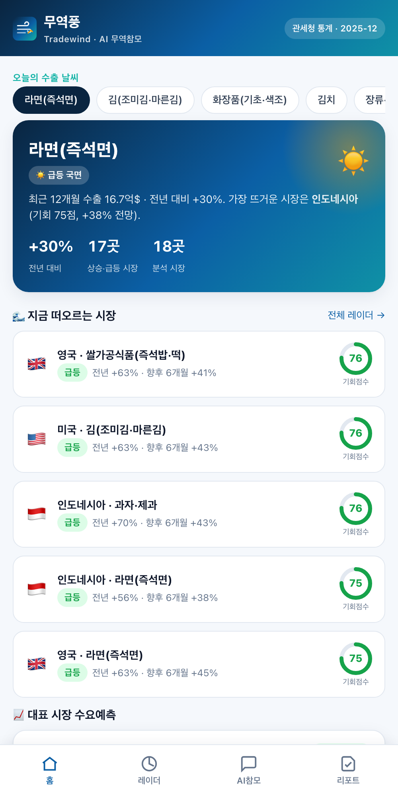
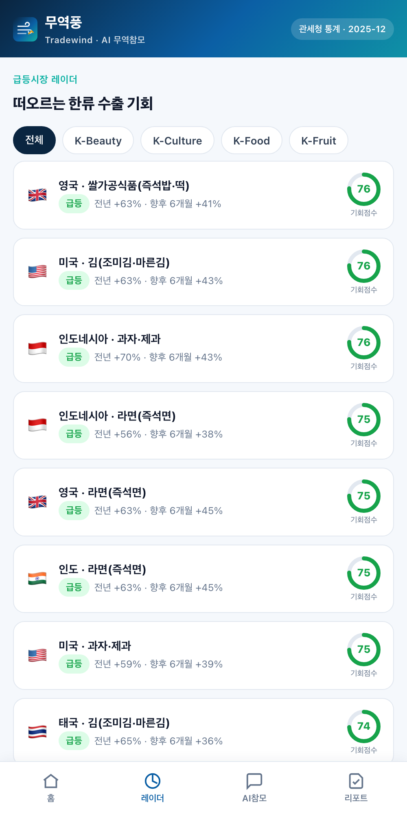
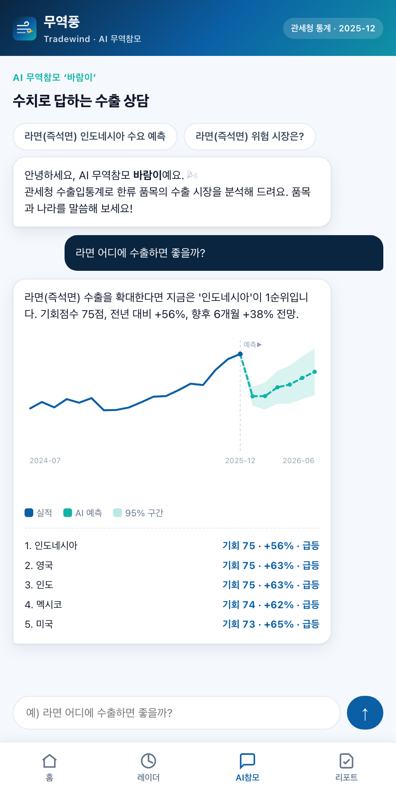
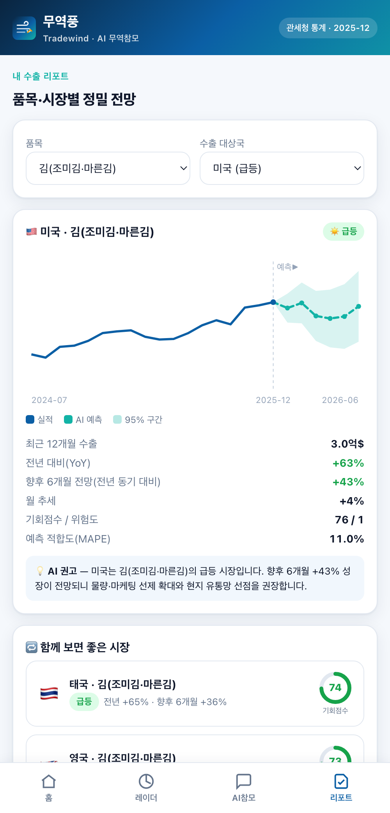

<p align="center">
  
</p>

<h1 align="center">무역풍 · Tradewind</h1>

<p align="center"><strong>관세청 수출입통계와 국산 AI로 한류 수출 수요를 예측하고, 떠오르는 시장을 먼저 알려주는 AI 무역참모.</strong></p>

<p align="center">
  
  
  
  
  
</p>

<p align="center">
  <a href="https://spcx0701.github.io/tradewind/"><strong>웹앱</strong></a> ·
  <a href="https://spcx0701.github.io/tradewind/home.html"><strong>서비스 소개</strong></a> ·
  <a href="https://spcx0701.github.io/tradewind/dashboard.html"><strong>B2G 관제 콘솔</strong></a> ·
  <a href="https://www.data.go.kr/data/15100475/openapi.do"><strong>관세청 데이터</strong></a>
</p>

> **2026 관세청 공공데이터·AI 활용 창업경진대회** 출품작 (제품 및 서비스 개발 부문).
> K-Food·K-뷰티·K-컬처 **수출 소상공인·중소기업**을 위한 서비스입니다.

<p align="center">
  
  
  
  
</p>

---

## 무엇을 하나요

수출을 시작하려는 소상공인의 가장 큰 질문은 **"어느 나라부터 뚫어야 하나?"** 입니다.
대기업은 시장조사팀이 있지만, K-푸드 소상공인은 감(感)에 의존합니다.
무역풍은 관세청 무역통계를 국산 AI로 해석해 그 결정을 데이터로 바꿔줍니다.

| 기능 | 설명 |
|------|------|
| 🌤️ **수출 일기예보** | 품목·국가별 향후 6개월 수요를 예측해 ‘맑음/흐림’으로 표시 |
| 📡 **급등시장 레이더 & 조기경보** | 떠오르는 시장(기회)·식어가는 시장(리스크)을 기회점수로 신호 |
| 💬 **AI 무역참모 ‘바람이’** | “라면 어디에 팔까?” → 실제 수출 수치를 **근거로** 답변(환각 차단) |
| 📊 **B2G 관제 콘솔** | 관세청·KOTRA·지자체 수출지원기관용 한류 수출 동향 히트맵(공공 환류) |

## 데이터 + AI (국산)

- **필수 공공데이터** — 관세청 [품목별 국가별 수출입실적](https://www.data.go.kr/data/15100475/openapi.do)(공공데이터포털, `apis.data.go.kr/1220000/nitemtrade`). HS코드 × 국가 × 월 수출입 금액·중량.
- **국산 AI(자체 개발)** — 외산 모델·API 의존 없이 `numpy`만으로 구현:
  - 수요예측: **승법 계절분해 + 감쇠 로그선형 추세 외삽** ([server/forecasting.py](server/forecasting.py))
  - 조기경보: 모멘텀·가속도·변동성 기반 기회/리스크 스코어 ([server/radar.py](server/radar.py))
  - AI 상담: 수치 근거 검색 후 한국어로 응답, **국산 LLM(Solar·HyperCLOVA X) 어댑터** 연동 ([server/advisor.py](server/advisor.py))

> 심사 가점(국산 AI 최대 +5점)에 직접 대응합니다.

## 작동 방식

```
관세청 OpenAPI ──(customs_client)──▶ snapshot.json ──(forecasting·radar)──▶ app/data/*.json ──▶ 정적 PWA
       └ 실서비스: 인증키로 실시간 동기화        └ 데모: 재현 가능 스냅샷(오프라인 동작)         └ 또는 FastAPI 라이브 API(/api)
```

정적 PWA는 백엔드 없이 **100% 오프라인 동작**하고(데모가 항상 작동), 동일 로직을 FastAPI가 라이브 API로도 제공합니다.

## 빠른 시작

```bash
pip install -r requirements-dev.txt
python scripts/generate_snapshot.py     # 관세청 스냅샷 생성
python scripts/build_app_data.py        # AI 산출물 → app/data/*.json
python scripts/serve.py                 # 웹앱: http://localhost:5183
# (선택) uvicorn server.main:app --reload   # 라이브 API + 앱
pytest -q                               # 테스트
```

## 구조

```
server/      FastAPI · 예측·레이더·AI 상담 엔진 + 관세청 API 클라이언트
app/         정적 PWA(웹앱·B2G 대시보드·랜딩) + 미리 구운 데이터
scripts/     스냅샷 생성 · 데이터 빌드 · 서버 · 화면 캡처
packaging/   Android(네이티브 Compose + TWA)
deliverables/ 대회 제출물(기획서·공통양식·발표자료)
docs/        아키텍처 · 데이터 출처
```

## 모바일 앱

설치형 **PWA**(홈 화면 추가) + **네이티브 Android**(Jetpack Compose 홈 + TWA 풀스크린) — [packaging/android](packaging/android) 참고.

## 라이선스

[MIT](LICENSE). 데모 데이터는 관세청 공개 통계에 앵커링한 대표 스냅샷이며 개인·기업 식별정보를 포함하지 않습니다.
