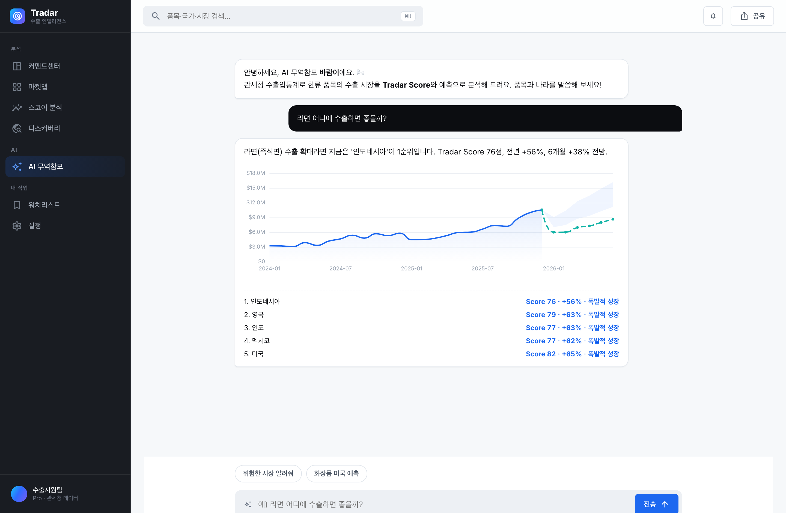

<p align="center">
  
</p>

<h1 align="center">Tradar · 트레이더</h1>

<p align="center"><strong>관세청 수출입통계와 국산 AI로 한류 수출 시장을 스코어링하고, 떠오르는 시장을 먼저 포착하는 수출 인텔리전스 플랫폼.</strong></p>

<p align="center">
  
  
  
  
  
</p>

<p align="center">
  <a href="https://spcx0701.github.io/tradewind/"><strong>플랫폼 열기</strong></a> ·
  <a href="https://spcx0701.github.io/tradewind/home.html"><strong>서비스 소개</strong></a> ·
  <a href="https://spcx0701.github.io/tradewind/dashboard.html"><strong>B2G 관제 콘솔</strong></a> ·
  <a href="https://www.data.go.kr/data/15100475/openapi.do"><strong>관세청 데이터</strong></a>
</p>

> **2026 관세청 공공데이터·AI 활용 창업경진대회** 출품작 (제품 및 서비스 개발 부문).
> K-Food·K-뷰티·K-컬처 **수출 소상공인·중소기업**을 위한 수출 인텔리전스 플랫폼.

<p align="center">
  
  
</p>
<p align="center">
  
  
</p>

---

## 무엇을 하나요

수출을 시작하려는 소상공인의 가장 큰 질문은 **"어느 나라부터 뚫어야 하나?"** 입니다.
Tradar는 관세청 무역통계를 국산 AI로 해석해 그 결정을 데이터로 바꿉니다.

| 화면 | 설명 |
|------|------|
| 🧭 **커맨드센터** | Top Opportunities · Fastest Rising · Markets Heating Up · Risk Alerts를 한눈에 |
| 🗺️ **마켓맵** | FINVIZ 스타일 트리맵 — 타일 크기=수출액, 색=모멘텀(초록 상승 / 빨강 둔화) |
| 📊 **스코어 분석** | **Tradar Score**(수요·성장·안정성·잠재력 종합 0~100) + 6개월 AI 예측·유사 시장 클러스터 |
| 💬 **AI 무역참모 ‘바람이’** | “라면 어디에 팔까?” → 실제 수출 수치·스코어를 **근거로** 답변(환각 차단) |
| 🔎 **디스커버리** | 156개 시장을 스코어로 정렬·필터 탐색 · **B2G 콘솔**(공공 환류 히트맵) |

⌘K 커맨드 팔레트 · 워치리스트 · 오프라인 PWA 지원.

## 데이터 + AI (국산)

- **필수 공공데이터** — 관세청 [품목별 국가별 수출입실적](https://www.data.go.kr/data/15100475/openapi.do)(공공데이터포털, `apis.data.go.kr/1220000/nitemtrade`). HS코드 × 국가 × 월 수출입.
- **국산 AI(자체 개발, numpy)** — 외산 모델·API 의존 없이:
  - 수요예측: 승법 계절분해 + 감쇠 로그선형 추세 ([server/forecasting.py](server/forecasting.py))
  - 조기경보: 모멘텀·가속도·변동성 스코어 ([server/radar.py](server/radar.py))
  - **Tradar Score**: 수요·성장·안정성·잠재력 종합 ([server/scoring.py](server/scoring.py))
  - AI 상담: 수치 근거 검색 NLG + 국산 LLM(Solar·HyperCLOVA X) 어댑터 ([server/advisor.py](server/advisor.py))

> 심사 가점(국산 AI 최대 +5점)에 직접 대응합니다.

## 작동 방식

```
관세청 OpenAPI ──(customs_client)──▶ snapshot.json ──(forecasting·radar·scoring)──▶ app/data/*.json ──▶ 정적 SPA(ECharts)
       └ 실서비스: 인증키로 실시간 동기화        └ 데모: 재현 가능 스냅샷(오프라인 동작)             └ 또는 FastAPI 라이브 API(/api)
```

## 빠른 시작

```bash
pip install -r requirements-dev.txt
python scripts/generate_snapshot.py     # 관세청 스냅샷 생성
python scripts/build_app_data.py        # AI 산출물(예측·레이더·스코어) → app/data/*.json
python scripts/serve.py                 # 플랫폼: http://localhost:5183
pytest -q                               # 테스트
```

## 구조

```
server/      FastAPI · 예측·레이더·스코어·AI 상담 엔진 + 관세청 API 클라이언트
app/         정적 SPA(Tradar 플랫폼·B2G 콘솔·랜딩), tradar.css 디자인 시스템, ECharts
scripts/     스냅샷 생성 · 데이터 빌드 · 서버 · 화면 캡처
packaging/   Android(Jetpack Compose + TWA)
deliverables/ 대회 제출물(기획서·공통양식·발표자료)
docs/        아키텍처 · 데이터 출처
```

## 디자인 시스템

Tradar UI는 Chartmetric 스타일의 라이트 데이터-덴스 디자인 시스템([app/tradar.css](app/tradar.css))을 따릅니다 —
다크 사이드바 + 화이트 캔버스, 절제된 블루 액센트, 브랜드 그라디언트, 탭ular 숫자, ECharts 시각화.

## 라이선스

[MIT](LICENSE). 데모 데이터는 관세청 공개 통계에 앵커링한 대표 스냅샷이며 개인·기업 식별정보를 포함하지 않습니다.
