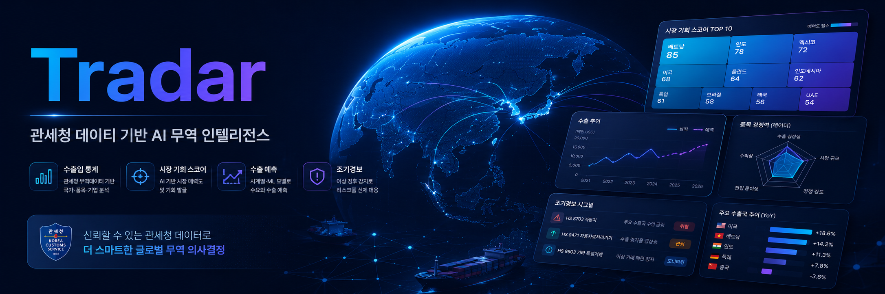
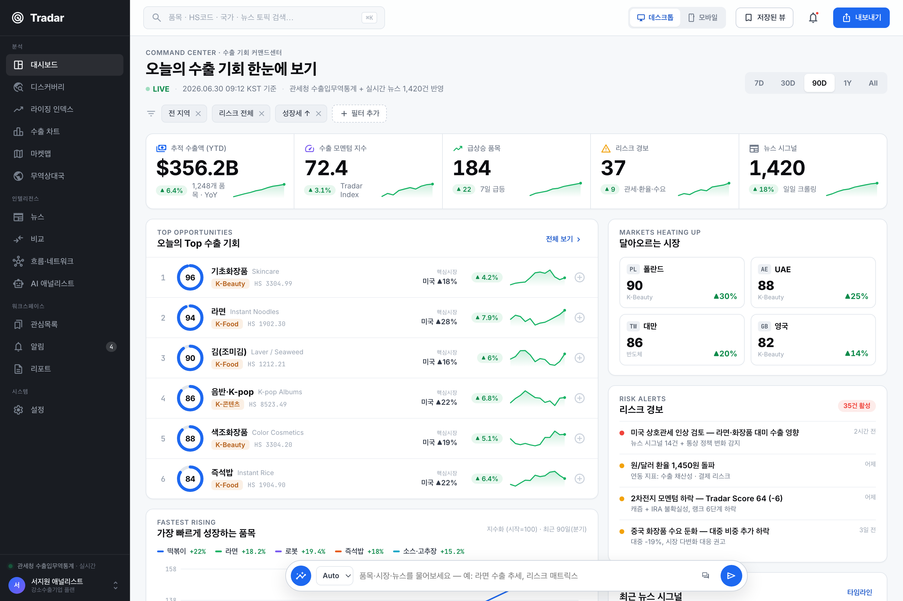
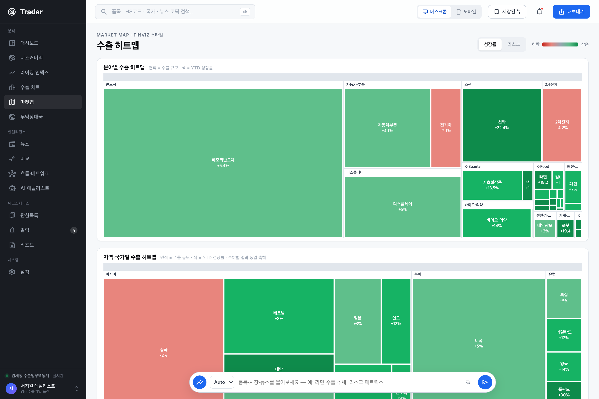
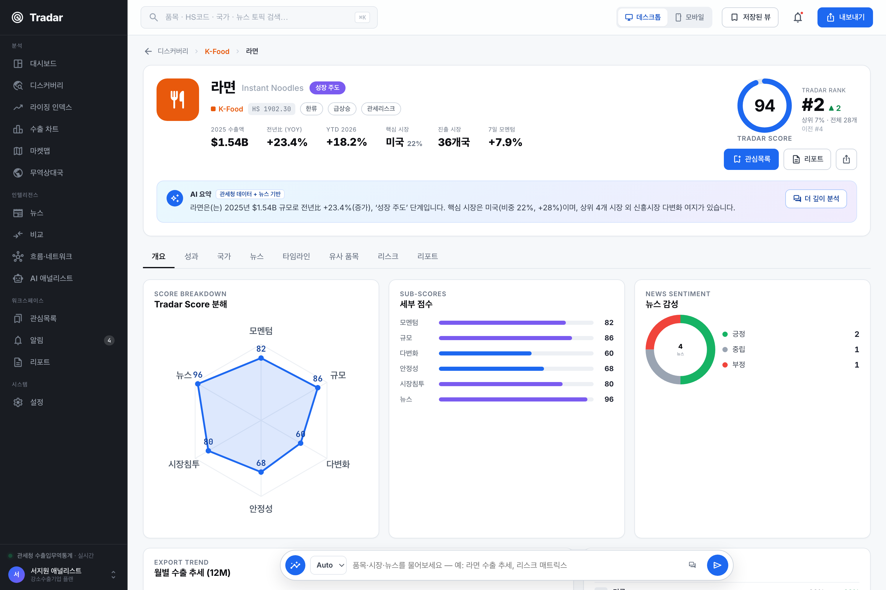
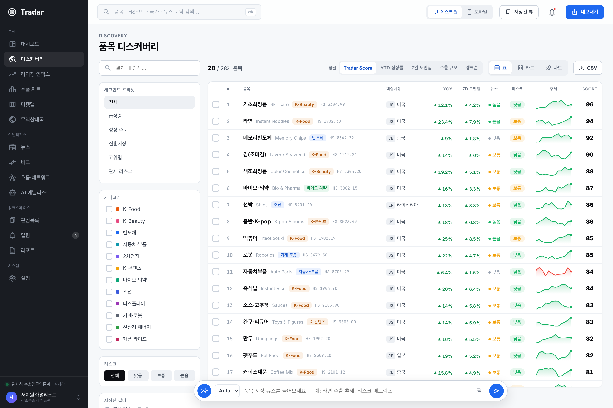

<p align="center">
  
</p>

# Tradar · 트레이더

<p align="center"><strong>관세청 수출입통계(HS코드)와 AI로 전 수출산업의 품목·국가별 시장을 스코어링·예측하는 수출 데이터 분석 플랫폼.</strong></p>

<p align="center">
  <a href="https://github.com/spcx0701/tradar/releases/latest"></a>
  <a href="https://github.com/spcx0701/tradar/actions/workflows/ci.yml"></a>
  <a href="https://github.com/spcx0701/tradar/actions/workflows/codeql.yml"></a>
  <a href="https://www.codefactor.io/repository/github/spcx0701/tradar"></a>
  <a href="https://codecov.io/gh/spcx0701/tradar"></a>
  <a href="https://scorecard.dev/viewer/?uri=github.com/spcx0701/tradar"></a>
  <a href="https://www.bestpractices.dev/en/projects/13452"></a>
  <a href="https://sonarcloud.io/summary/overall?id=spcx0701_tradewind&branch=main"></a>
  <a href="https://sonarcloud.io/summary/overall?id=spcx0701_tradewind&branch=main"></a>
  <a href="https://sonarcloud.io/summary/overall?id=spcx0701_tradewind&branch=main"></a>
  <a href="https://sonarcloud.io/summary/overall?id=spcx0701_tradewind&branch=main"></a>
</p>

<p align="center">
  <a href="https://spcx0701.github.io/tradar/"><strong>플랫폼 열기 →</strong></a> ·
  <a href="https://www.data.go.kr/data/15100475/openapi.do"><strong>관세청 데이터</strong></a>
</p>

> **2026 관세청 공공데이터·AI 활용 창업경진대회** 출품작 (제품 및 서비스 개발 부문).
> 반도체·자동차·2차전지·조선부터 K-Food·K-뷰티까지 **전 수출산업 28개 품목 × 주요국**을 다룹니다.

<p align="center">
  
  
</p>
<p align="center">
  
  
</p>

---

## 화면

| 화면 | 설명 |
|------|------|
| 🧭 **커맨드센터** | Top 수출 기회 · 달아오르는 시장 · 리스크 경보 · 뉴스 시그널을 한눈에 |
| 🗺️ **마켓맵** | FINVIZ 스타일 트리맵 — 타일 크기=수출액, 색=모멘텀(초록 상승 / 빨강 둔화). 분야별·국가별 |
| 📊 **스코어 프로파일** | 품목별 **Tradar Score**·하위점수·수출 추세·국가별 구성·이벤트 타임라인·리스크 인덱스 |
| 🔎 **디스커버리** | 28개 품목을 Tradar Score로 정렬·카테고리 필터(K-Food/반도체/2차전지…) |
| 📰 **뉴스 인텔리전스** | 실시간 뉴스 시그널을 품목·시장에 자동 연결(감성·영향도·관련 품목) |
| 💬 **AI 애널리스트** | 품목·시장·뉴스를 실제 수치 근거로 답변. ⌘K 커맨드 팔레트 |

## 데이터 (관세청 실데이터 연동)

- **필수 공공데이터** — 관세청 [품목별 국가별 수출입실적](https://www.data.go.kr/data/15100475/openapi.do)(공공데이터포털, `apis.data.go.kr/1220000/nitemtrade`). 각 품목의 **HS코드 기준**으로 연동.
- **파이프라인** — [scripts/build_tradar_data.py](scripts/build_tradar_data.py) 가 HS코드별 실적을 받아 연수출액·전년비·국가별 비중을 계산해 `app/data/tradar.js`로 굽는다.
  - `DATA_GO_KR_KEY` 설정 시 data.go.kr에서 **실시간 동기화**([server/customs_client.py](server/customs_client.py)).
  - 미설정 시 **2024년 관세청 공표치 앵커**(데모가 항상 동작).
- **AI/분석(국산)** — Tradar Score(시장 매력도), 수요 추세, 이상탐지 등은 앱 내 자체 로직으로 산출. 별도 국산 AI 엔진(승법 계절분해·조기경보·근거기반 상담)이 [server/](server/)에 포함되어 파이프라인에 연결 가능.

> 관세청 공공데이터(필수) + 국산 AI → 심사 가점(국산 AI 최대 +5점)에 직접 대응.

## 작동 방식

```
관세청 품목별 국가별 수출입실적 (HS코드)
        │  scripts/build_tradar_data.py  (인증키 시 실시간 / 미설정 시 2024 공표치 앵커)
        ▼
app/data/tradar.js  ──▶  Tradar SPA (React + ECharts, Chartmetric 디자인시스템)
```

## 빠른 시작

```bash
python scripts/build_tradar_data.py     # 관세청 데이터 → app/data/tradar.js (인증키 시 실시간)
python scripts/serve.py                 # 플랫폼: http://localhost:5183
```

English documentation is available in [docs/ENGLISH.md](docs/ENGLISH.md).

## 참여와 피드백

- 버그와 개선 제안은 [GitHub Issues](https://github.com/spcx0701/tradar/issues)로 남깁니다.
- 코드 변경은 브랜치를 만든 뒤 pull request로 제안합니다. PR 전에 [CONTRIBUTING.md](CONTRIBUTING.md)의 테스트와 린트 명령을 실행합니다.
- 악용 가능한 취약점, 비밀값 노출, 인증 우회, 데이터 노출 가능성은 공개 이슈 대신 [GitHub Security Advisory](https://github.com/spcx0701/tradar/security/advisories/new)로 비공개 신고합니다.

## API 인터페이스

FastAPI 서버는 정적 PWA와 함께 `/api/*` JSON 인터페이스를 제공합니다.

| 엔드포인트 | 입력 | 출력 |
|---|---|---|
| `GET /api/health` | 없음 | 서비스 상태, 데이터 기간, 품목 수 |
| `GET /api/catalog` | 없음 | 메타데이터, 국가 목록, 품목 카탈로그 |
| `GET /api/forecast?hs=1902.30&country=US&horizon=6` | HS 코드, 국가 코드, 1-12개월 예측 기간 | 과거 시계열, 예측 평균·상하한, 추세, 시장 시그널 |
| `GET /api/radar?limit=24` | 반환 개수 | Top 수출 기회와 리스크 경보 |
| `GET /api/radar/product/{hs}` | HS 코드 | 품목별 국가 시장 레이더 |
| `POST /api/advisor` | `{"question": "..."}` | 질문 의도, 답변, 수치 근거 |

## 구조

```
app/
  index.html         Tradar 플랫폼(Claude Design 원본) + PWA 메타
  vendor/generated/ 디자인 런타임(dc-runtime)과 생성된 디자인 시스템 번들
  _ds/               Chartmetric 디자인 시스템(토큰·스타일·컴포넌트)
  data/tradar.js     관세청 연동 데이터(build_tradar_data.py 산출)
  vendor/            React 18 · ECharts 5 (오프라인용 로컬 벤더링)
server/              관세청 API 클라이언트 + 국산 AI 엔진(예측·스코어·상담)
scripts/             build_tradar_data.py(데이터 파이프라인) · serve · capture
packaging/android/   Android(Jetpack Compose + TWA)
deliverables/        대회 제출물(기획서·공통양식·발표자료)
design/              Tradar.dc.html 원본(Claude Design 소스)
```

## 디자인 시스템

Tradar UI는 Chartmetric 스타일의 라이트 데이터-덴스 디자인 시스템([app/_ds](app/_ds))을 따릅니다 —
다크 사이드바 + 화이트 캔버스, 절제된 블루 액센트, 브랜드 그라디언트(cyan→blue→violet), 탭ular 숫자, ECharts 시각화.

## 라이선스

[MIT](LICENSE). 데모 데이터는 관세청 공개 통계에 앵커링한 값이며 개인·기업 식별정보를 포함하지 않습니다.
